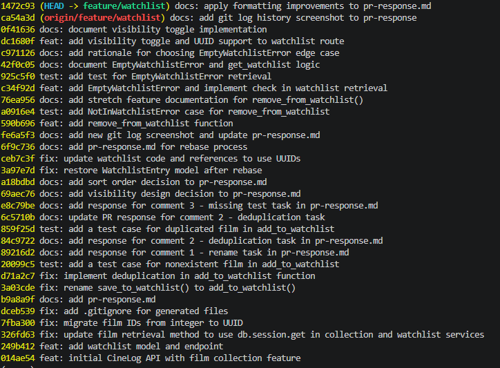

# PR Response Doc — CineLog Watchlist Feature

## AI Usage
<!-- Fill in at the end — how you used AI tools during this project -->
I primarily utilized AI tools to assist with three key areas of the development and documentation process:

**1. Verifying Commit Formats**
I provided my `git log --oneline` output to the AI and prompted it to refine the entries based on the [Conventional Commits specification](https://www.conventionalcommits.org/). Before applying any changes, I carefully reviewed the AI-generated suggestions to ensure they accurately reflected my work.

**2. Researching Responses for Comments 4 and 5**  
I required additional background knowledge to provide in-depth responses for comments 4 and 5. While I had a basic understanding of the requirements, I prompted the AI to help me identify industry best practices for an application like `CineLog`. 

For comment 4, regarding default visibility, I initially considered keeping it public. However, the AI provided insights into security and user privacy, suggesting that private-by-default is standard practice. After reviewing this information, I initially shifted to a private-only default. Ultimately, because `CineLog` is a community-focused application, I synthesized these insights into a hybrid approach, which I believe is the ideal solution.

**3. Refining Documentation**  
AI was also instrumental in improving the quality of my documentation. I used it to refine my phrasing, enhance technical vocabulary, and correct grammar and spelling throughout this document to ensure my explanations were clear and professional.

## Comment 1 — Rename
**What I did:** I renamed the `save_to_watchlist()` function to `add_to_watchlist()` in `services/watchlist_service.py`.  
**How I verified:** I identified all call sites by highlighting the function name and pressing `Shift + Alt + F12` in VS Code. This allowed me to locate and update every reference throughout the project to ensure consistency.

## Comment 2 — Deduplication
**What I did:** I implemented deduplication logic in the `add_to_watchlist()` function within `services/watchlist_service.py`. This ensures that a user cannot add the same film to their watchlist more than once. If a user attempts to add an existing film, the function now raises an `AlreadyInWatchlistError` exception.  
**How I verified:** I followed the pattern established in `add_to_collection()`, which queries the database for an existing entry and raises an `AlreadyInWatchlistError` if a duplicate is found. I verified this by running my test case to confirm that adding a duplicate film now correctly triggers the expected error rather than creating a new database record.

## Comment 3 — Missing test
**What I did:** I implemented the `test_add_to_watchlist_nonexistent_film_raises()` test case in `tests/test_watchlist.py`. This verifies that the `add_to_watchlist()` function correctly raises a `FilmNotFoundError` exception when an attempt is made to add a film that does not exist in the database. This test is the functional equivalent of the `test_add_to_collection_nonexistent_film_raises()` test found in `test_collection.py`.
**How I verified:** I followed the same fixture and assertion pattern used in `test_add_to_collection_nonexistent_film_raises()` to ensure consistency across the service layer. After implementing the test, I executed `pytest tests/test_watchlist.py -v`, which passed successfully. Finally, I ran the full test suite using `pytest tests/ -v` to confirm that all tests pass and no regressions were introduced.

## Comment 4 — Default visibility
**My position:** I believe the default visibility should be set to private (public=False). Although CineLog is a community-driven film tracking app, user privacy remains paramount. We must develop the platform according to industry best practices and adhere to data protection regulations. Therefore, I recommend a hybrid approach: keep the default visibility private, while providing users with an easy way to toggle their lists to public. This approach strikes a balance between protecting user privacy and empowering social users to share their lists, ultimately supporting our goal of building a community for movie lovers.  
**Reasoning:** The primary reason for defaulting the visibility to private is to prioritize user privacy and ensure adherence to data protection regulations (ex: GDPR or CCPA ) regarding the collection, storage, and processing of personal information. Furthermore, a "private by default" approach encourages user trust, reduces the friction associated with adding sensitive content to a watchlist, and empowers users by giving them granular control over their data visibility.
**Tradeoff acknowledged:**  
Making the default visibility private may contradict the primary goal of this application, as CineLog is designed as a community film-tracking app. This approach could potentially diminish the sense of community among users, as it discourages the sharing of interests. Consequently, this may negatively impact social interaction within the platform.

## Comment 5 — Sort order
**My position:** I believe the default sort order should be `date-added`, as users typically prefer to see the most recently added films at the top of their list. However, I recommend providing a control that allows users to toggle between alphabetical and date-added sorting.  
**Reasoning:**
For users who choose to share their watchlists, the primary goal is often to engage with friends and the broader community by showcasing their current interests and upcoming film plans. By defaulting to date-added, we ensure that the most relevant, current items are displayed prominently. Supporting this social interaction not only strengthens our community but also provides valuable data for future features, such as a personalized recommendation engine based on user preferences. By prioritizing chronological order as the default, we create a predictable activity stream that facilitates social discovery and future content-recommendation features.

Conversely, for users who prioritize privacy, providing the option to keep their watchlists private is essential. In these cases, offering an alphabetical sort option provides a cleaner, more organized way for them to manage their personal collections.

**Engagement with reviewer's point:**
I agree with the reviewer's observation that most users prefer to see their most recently added films first. This is the most intuitive way to sort a watchlist and aligns perfectly with the app’s goal of building a community of movie lovers. Sorting alphabetically by default could diminish the user experience, as it would force users to scroll through their entire list to find the films they added most recently. However, as noted, implementing a manual sort control will provide the necessary flexibility for users who prefer an alphabetical structure for their personal collections.

## Comment 6 — Rebase
***What conflicted:***
I encountered a merge conflict in `.gitignore` due to my local inclusion of `.pytest_cache`, which conflicted with the updated `main` branch. 
While the rebase process itself did not flag conflicts within `services/watchlist_service.py`, I identified a subsequent issue where the `WatchlistEntry` model was missing or altered in `models.py`.  
***How I resolved it:***
1.  **Git Conflict:** I resolved the merge conflict in `.gitignore` by merging my local configuration with the required project-standard exclusions. After staging the changes with `git add .gitignore`, I completed the rebase using `git rebase --continue`.
2.  **Schema & Implementation Updates:** 
    *   **Models:** Updated `models.py` to define the `WatchlistEntry` model, ensuring the `film_id` property uses `db.String(36)` to support UUIDs: `film_id = db.Column(db.String(36), db.ForeignKey("film.id"), nullable=False)`.
    *   **Service Layer:** Updated the docstring in the `add_to_watchlist()` function within `services/watchlist_service.py` from `film_id (int)` to `film_id (str)` to correctly reflect the UUID requirement. No changes to the underlying logic were required as the implementation was already compatible.
    *   **API Documentation:** Updated the route documentation in `routes/watchlist/watchlist.py` for the POST endpoint to clarify that the request body now expects a UUID string (`{ "film_id": "<uuid>" }`) rather than an integer.

***How I verified no conflict remains:***
I verified the stability of my changes by running the full test suite. Specifically, I ran `pytest tests/test_watchlist.py -v` to confirm that `add_to_watchlist()` handles the new UUID requirements correctly and satisfies all test cases. Additionally, I ran `pytest tests/test_collection.py -v` to ensure that my changes did not introduce any regressions in the existing collection service functionality. All tests passed successfully.

## Stretch Features
### Remove an entry from Watchlist
**What it does:** I implemented the `remove_from_watchlist()` function, which removes a specified film from a user's watchlist. If the `film_id` does not exist on that user's watchlist, the function gracefully handles it by raising a `NotInWatchlistError` exception.

**Following patterns:** I followed the existing pattern found in `remove_from_collection()` within `services/collection_service.py`, using the same database session handling, consistent parameter ordering, and similar error-checking logic.

**Verification:** I added a test in `tests/test_watchlist.py` to confirm that removing a valid film updates the database and that attempting to remove a non-existent film does not cause an unexpected crash.

### Test for Edge case: removing an entry from an empty watchlist

**What it does:** I implemented a custom `EmptyWatchlistError` exception, which is raised by the `get_watchlist(user_id)` function whenever a retrieval request is made for a user whose watchlist contains no entries. 

**Following patterns:** This adheres to the project's pattern of using domain-specific exceptions to communicate state-based errors, similar to how I handled the `NotInWatchlistError` for the removal function. It ensures that the calling code can differentiate between a system error and an empty state.

**Verification:** I added the test case `test_get_watchlist_empty_raises()` in `tests/test_watchlist.py` to confirm that calling `get_watchlist()` for a user with no films correctly raises this exception, ensuring the system handles empty lists explicitly rather than returning a vague `None` or an empty list without warning.

**Rationale for this edge case:** I chose to test the empty watchlist scenario because it represents a common "boundary" state that often causes bugs in applications—specifically, code that assumes a list exists and tries to iterate over it will crash if the list is missing or empty. By explicitly raising and testing for `EmptyWatchlistError`, I ensure the API remains predictable and that the frontend or calling services receive a clear, actionable error instead of an unexpected crash.

### Visibility Toggle

**How it works:**
The `add_to_watchlist()` endpoint now accepts an optional JSON parameter named **`public`**. 

*   **Functionality:** This boolean value determines whether the film entry is visible to other users (public) or hidden (private) within the user's watchlist. 
*   **The Default:** If a caller does not provide the `public` parameter, the system defaults to **`True`**, ensuring that existing API integrations continue to create public watchlist entries without requiring any code changes.
*   **How a caller uses it:** 
    *   **To create a public entry (or use default):** 
        `POST /watchlist/<user_id>/add` with body `{"film_id": "<uuid>"}` 
        *(The system automatically sets `public: true`)*.
    *   **To create a private entry:** 
        `POST /watchlist/<user_id>/add` with body `{"film_id": "<uuid>", "public": false}`.

**Verification:** I verified this by manually testing both scenarios via `curl` requests, checking the database after each call to ensure the `public` column in the `WatchlistEntry` table correctly reflected the value sent in the request body.

## Commit History

## PR Description
<!-- Written at the end — feature overview, design decisions, manual testing steps -->
### Watchlist feature functionality:**

* The watchlist feature allows users to save a film to watch later.
* Films are added to the list as `WatchlistEntry` objects.

**Design decisions (default visibility and sort order):**

* **Default Visibility:** I believe in a balanced approach: keeping the default visibility private (i.e., `public = db.Column(db.Boolean, default=False)`) and allowing the user to choose whether to make it public.
* **Sort Order:** I agree with the reviewers' position to sort the list by the `date_added` property by default. Additionally, I recommend adding a control that lets users toggle between alphabetical and `date_added` sorting.

### Manual Testing Instructions

To ensure the watchlist feature is functioning correctly, perform the following tests:

1. **Add a Film to Watchlist:**
* Navigate to a film’s detail page.
* Click the "Add to Watchlist" button.
* Verify that the film appears in your Watchlist page.
* Check the database to confirm a new `WatchlistEntry` object was created for that user and film.

2. **Verify Default Visibility:**
* Add a film to your watchlist.
* Check the entry in the database. Ensure the `public` column is set to `False` by default.

3. **Test Sort Order:**
* Add multiple films to your watchlist at different times.
* Load the Watchlist page and verify the list is sorted by `date_added` (newest first) by default.
* Use the sorting toggle (if implemented) to switch to alphabetical order. Ensure the films are reordered correctly by title.

4. **Test Toggle Controls (if applicable):**
* If you have implemented the requested UI controls, click the toggle to switch between sorting methods.
* Verify that the UI updates immediately without needing a full page refresh.

5. **Edge Case Testing:**
* Attempt to add the same film to the watchlist twice (ensure it handles duplicates appropriately).
* Ensure that the "Add to Watchlist" button is disabled or hidden for films already in the user's list.